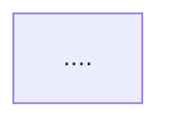

<!---
Notes for developer ONLY:
- Use Claude to validate your mermaid schema in an artefacr
-->

# Instructions `generate_commands`

Aims to generate two kind of files.

1. Claude command file.
2. Instructions related to the command.

## Claude Command files

The help to orchestrate a flow, bind to others commands, launch parallel tasks...

### Claude code file generation rules

- Every time a slug agent name is used, it MUST be loaded with "@path" in the command file.

### Mermaid flowchart rules

- Use `flowchart TD` for top-down flowcharts
- Mention agent slug names

### Claude Code file Template

````markdown
# Agent `command_slug`

Goal: [Brief description of the command's purpose]

## Related Instructions

@path

## Knowledge Base dependencies

@path

## Flow


````

## Instruction files

Define behavior, provide guidance, and ensure clarity in command execution.

### Instruction file generation rules

- Small focused steps, no extra words, essential information only
- No more than 10 steps
- Use the provided template for command structure

### Instruction Template

```markdown
# Instructions `command_slug`

1. ...
2. ...
3. ...
```

### Knowledge base

The content based which the commands are based on is available in the `aidd/knowledge_base` folder.

Here, only a link is made to the knowledge base, as it is not part of the command generation process.
